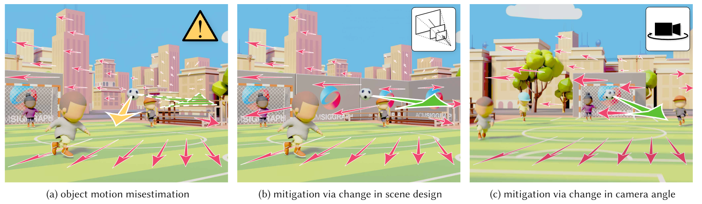

# Evaluating Visual Perception of Object Motion in Dynamic Environments

Authors: Budmonde Duinkharjav, Jenna Kang, Gavin S. P. Miller, Chang Xiao, Qi Sun



(a) shows a common animation and gaming scenario where the observer has to estimate the motion of a soccer ball in a 3D scene.
Due to perceptual errors in estimating motion vectors in screen-displayed graphics, we may significantly misestimate the direction of the soccer ball  (estimated leftward yellow vector vs. actual rightward green vector).
For an animated example, see the *supplementary video*.
To mitigate motion estimation inaccuracies and enhance task performance and perceptual fidelity, our perceptual model measures the correlation between estimation error, and scene dynamics and content.
These predicted measures lead to content designs optimized for minimizing perceptual errors in motion estimation, such as by adjusting scene depth with an added wall (b) or by altering camera angles (c).

## Abstract

Precisely understanding how objects move in 3D is essential for broad scenarios such as video editing, gaming, driving, and athletics.
With screen-displayed computer graphics content, users only perceive limited cues to judge the object motion from the on-screen optical flow.
Conventionally, visual perception is studied with stationary settings and singular objects.
However, in practical applications, we---the observer---also move within complex scenes.
Therefore, we must extract object motion from a combined optical flow displayed on screen, which can often lead to mis-estimations due to perceptual ambiguities.

We measure and model observers' perceptual accuracy of object motions in dynamic 3D environments, a universal but under-investigated scenario in computer graphics applications.
We design and employ a crowdsourcing-based psychophysical study, quantifying the relationships among patterns of scene dynamics and content, and the resulting perceptual judgments of object motion direction.
The acquired psychophysical data underpins a model for generalized conditions.
We then demonstrate the model's guidance ability to significantly enhance users' understanding of task object motion in gaming and animation design.
With applications in measuring and compensating for object motion errors in video and rendering, we hope the research establishes a new frontier for understanding and mitigating perceptual errors caused by the gap between screen-displayed graphics and the physical world.

## Project Page

Please see details about the project [here](https://www.budmonde.com/projects/motion-estimation/), including the paper manuscript, and supplementary video.
Please reach out to via email for study data.

## Usage

To run all the scripts for regenerating the figures from the paper, run `./plot_all_figures.sh`.

To demo the model, please look inside `plot_motion_model.py` and adjust your desired inputs as necessary.
For further details on how to interpret the required inputs to the model, please check our [paper](https://www.budmonde.com/projects/motion-estimation/).

## Citation

Budmonde Duinkharjav, Jenna Kang, Gavin S. P. Miller, Chang Xiao, Qi Sun<br/>
Evaluating Visual Perception of Object Motion in Dynamic Environments.<br/>
ACM Transactions on Graphics 43(6) (Proceedings of ACM SIGGRAPH Asia 2024)<br/>

```
@article{Duinkharjav2024MotionEstimation,
    title = {Evaluating Visual Perception of Object Motion in Dynamic Environments},
    author = {Duinkharjav, Budmonde and Kang, Jenna and Miller, Gavin Stuart Peter and Xiao, Chang and Sun, Qi},
    journal = {ACM Trans. Graph. (Proc. SIGGRAPH Asia)},
    volume = {43},
    number = {6},
    pages = {277:1--277:11},
    year = {2024}
}
```

## Acknowledgements

This project is partially supported by the National Science Foundation grant \#2232817/\#2225861, the DARPA Intrinsic Cognitive Security program, and a generous gift from Adobe. 
Part of the work was conducted during an internship at Adobe Research. 
Any opinions, findings, and conclusions or recommendations expressed in this material are those of the authors and do not necessarily reflect the views of the funding agencies.
